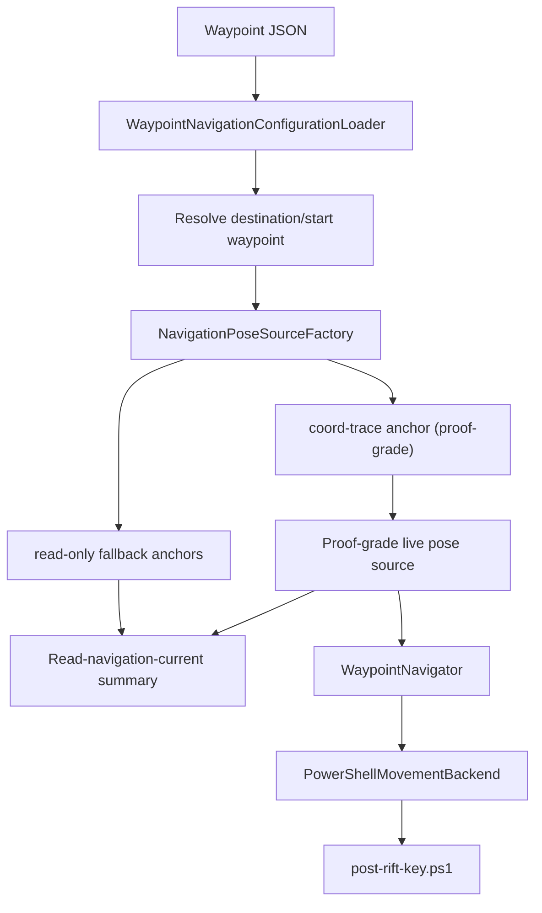
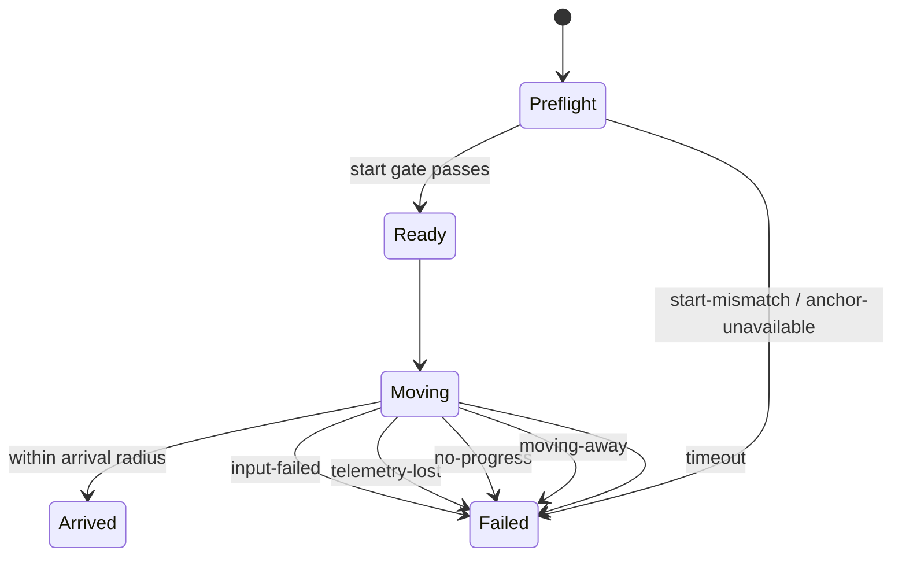

# Waypoint Navigation V1

## Status

Waypoint navigation v1 is implemented as of **April 16, 2026** for the external
reader in `C:\RIFT MODDING\RiftReader\reader\RiftReader.Reader`.

This first slice is intentionally narrow:

| Area | V1 behavior |
|---|---|
| Control model | **Manual-align first**. The operator faces the character roughly at the destination, then the navigator owns forward movement and optional pace toggles only. |
| Waypoint source | External tracked JSON at `C:\RIFT MODDING\RiftReader\scripts\navigation\waypoints.json` |
| Movement backend | .NET 10 orchestration with a thin adapter over `C:\RIFT MODDING\RiftReader\scripts\post-rift-key.ps1` |
| Live telemetry | Active movement requires the validated coord-trace anchor; read-only summaries may still surface fallback anchors when they are explicitly labeled by `anchorSource` |
| Addon boundary | Addon stays telemetry / validation only in v1 |
| Safety model | Fail closed on bad start, no progress, moving away, anchor loss, input failure, or timeout |

## Scope

### Included in v1

- waypoint-file-backed navigation config
- `--read-navigation-current` preflight vector summary
- `--navigate-waypoints` single-segment forward travel
- optional one-shot run / walk pace toggles
- verified live coord-anchor resolution before movement
- direct memory coord reads during movement
- stop reasons for the common unsafe or broken cases

### Explicit non-goals

- auto-turn
- strafe corrections
- obstacle avoidance
- route graphs
- multi-waypoint chaining
- terrain intelligence
- addon waypoint UI
- slash waypoint capture

## Architecture



### Pose resolution policy

`--navigate-waypoints` is now proof-strict:

1. current-process coord-trace anchor
2. fail closed with `anchor-unavailable`

`--read-navigation-current` remains read-only and may still fall back in this
order:

1. current-process coord-trace anchor
2. cached player-current anchor
3. one-time `PlayerCurrentReader.ReadCurrent(...)` reacquisition

If the summary output reports any `anchorSource` other than
`coord-trace-anchor`, treat it as a read-only fallback result rather than
proof-grade movement truth.

### State machine



## Waypoint file schema

Default file:

- `C:\RIFT MODDING\RiftReader\scripts\navigation\waypoints.json`

Schema:

```json
{
  "schemaVersion": 1,
  "movement": {
    "forwardKey": "w",
    "runKey": null,
    "walkKey": null,
    "defaultPace": "keep",
    "forwardPulseMilliseconds": 250,
    "postPulseSampleDelayMilliseconds": 150,
    "startRadius": 2.0,
    "defaultArrivalRadius": 1.5,
    "noProgressWindowMilliseconds": 1500,
    "minimumProgressDistance": 0.35,
    "wrongWayToleranceDistance": 0.75,
    "maxTravelSeconds": 30
  },
  "waypoints": [
    {
      "id": "example_start",
      "label": "Example Start",
      "zone": "optional metadata only",
      "x": 0.0,
      "y": 0.0,
      "z": 0.0,
      "arrivalRadius": 2.0,
      "pace": "keep"
    }
  ]
}
```

### Validation rules

The loader rejects:

- missing `movement.forwardKey`
- unsupported `schemaVersion`
- duplicate waypoint ids
- invalid pace values
- missing `x`, `y`, or `z`
- non-positive timing / radius / distance fields

`zone` is metadata only in v1 and is **not** enforced as a runtime gate.

## CLI

### Read-only navigation preflight

Returns the current vector from the live player position to the destination
waypoint.

```powershell
dotnet run --project C:\RIFT MODDING\RiftReader\reader\RiftReader.Reader\RiftReader.Reader.csproj -- `
  --process-name rift_x64 `
  --read-navigation-current `
  --destination-waypoint example_destination `
  --json
```

### Active waypoint travel

```powershell
dotnet run --project C:\RIFT MODDING\RiftReader\reader\RiftReader.Reader\RiftReader.Reader.csproj -- `
  --process-name rift_x64 `
  --navigate-waypoints `
  --start-waypoint example_start `
  --destination-waypoint example_destination `
  --pace keep `
  --json
```

### Supported navigation switches

| Switch | Meaning |
|---|---|
| `--navigation-waypoint-file <path>` | Optional override for the default waypoint JSON |
| `--read-navigation-current` | Read-only waypoint vector summary |
| `--navigate-waypoints` | Active waypoint travel |
| `--start-waypoint <id>` | Required for `--navigate-waypoints` |
| `--destination-waypoint <id>` | Required for both waypoint modes |
| `--pace run\|walk\|keep` | Optional pace override |
| `--arrival-radius <double>` | Override arrival radius |
| `--max-travel-seconds <int>` | Override movement timeout |
| `--json` | Structured output for either waypoint mode |

## Movement behavior

### Start gate

The start waypoint is a **gate**, not a path node.

Before movement begins, the reader checks the live player planar distance from
the configured start waypoint using **X/Z**. If that distance is greater than
`movement.startRadius`, the run aborts with `start-mismatch`.

### Pace handling

- `keep`: do not change pace state
- `run`: press `movement.runKey` once if configured
- `walk`: press `movement.walkKey` once if configured

If an explicit `run` or `walk` pace is requested but the required key cannot be
sent, the run fails closed with `input-failed`.

### Forward movement loop

Each loop:

1. press `movement.forwardKey` for `movement.forwardPulseMilliseconds`
2. wait `movement.postPulseSampleDelayMilliseconds`
3. read live coordinates directly from memory
4. recompute planar distance to the destination waypoint

Success condition:

- destination planar distance is within the effective arrival radius

Failure conditions:

- `no-progress`: not enough improvement within the configured no-progress window
- `moving-away`: distance increases past the wrong-way tolerance
- `telemetry-lost`: coord sample cannot be read mid-run
- `input-failed`: key post fails
- `timeout`: total runtime exceeds the max travel limit

## Output contracts

### `NavigationVectorSummary`

- current coord
- destination coord
- `deltaX`, `deltaY`, `deltaZ`
- `planarDistance` using **X/Z**
- `heightDelta` using **Y**
- `worldBearingRadians`
- `worldBearingDegrees`
- `withinArrivalRadius`

### `NavigationRunResult`

- `status`
- `startWaypointId`
- `destinationWaypointId`
- `pace`
- `anchorSource`
- `initialPlanarDistance`
- `finalPlanarDistance`
- `pulseCount`
- `stopReason`

## Safety rules

- do not send any input until a verified coord anchor is resolved
- do not start active movement from cached or reacquired fallback anchors
- do not keep moving if telemetry is lost
- do not continue if distance is getting worse
- do not continue if the player is not making measurable progress
- do not rely on saved-variable refresh during movement
- do not attempt turn, strafe, or obstacle-recovery logic in v1

## Live testing checklist

Use this checklist before tonight’s first live run:

| Step | Check |
|---|---|
| 1 | Confirm the target process is the intended Rift client |
| 2 | Confirm the character is manually facing roughly toward the destination |
| 3 | Run `--read-navigation-current` first and verify the destination vector looks sane |
| 4 | Confirm the current position is inside the start waypoint radius |
| 5 | Start with `--pace keep` unless run / walk toggles are already validated |
| 6 | Use open flat terrain for the first travel test |
| 7 | Expect failure stops instead of recovery behavior when facing or terrain is wrong |

## Current limitations

As of **April 16, 2026**:

- actor yaw / turn recovery on `main` is still stale
- waypoint navigation is **single-segment only**
- v1 is **straight-line, same-segment, no auto-turn, no obstacle avoidance**
- addon work remains minimal in v1

