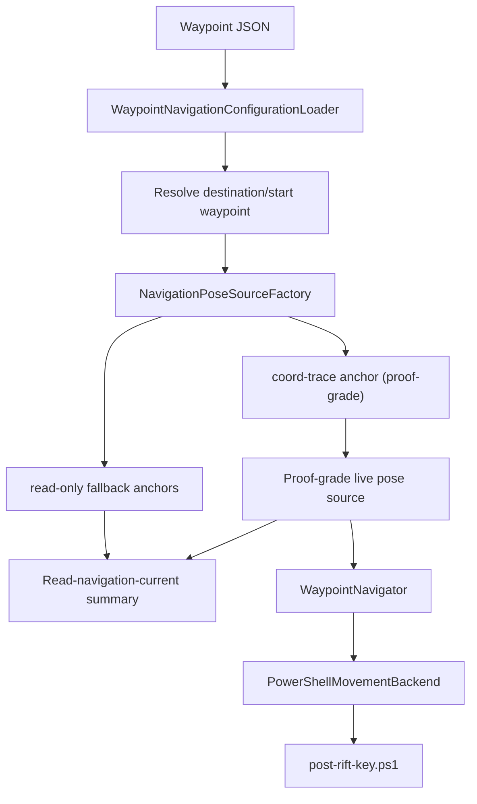
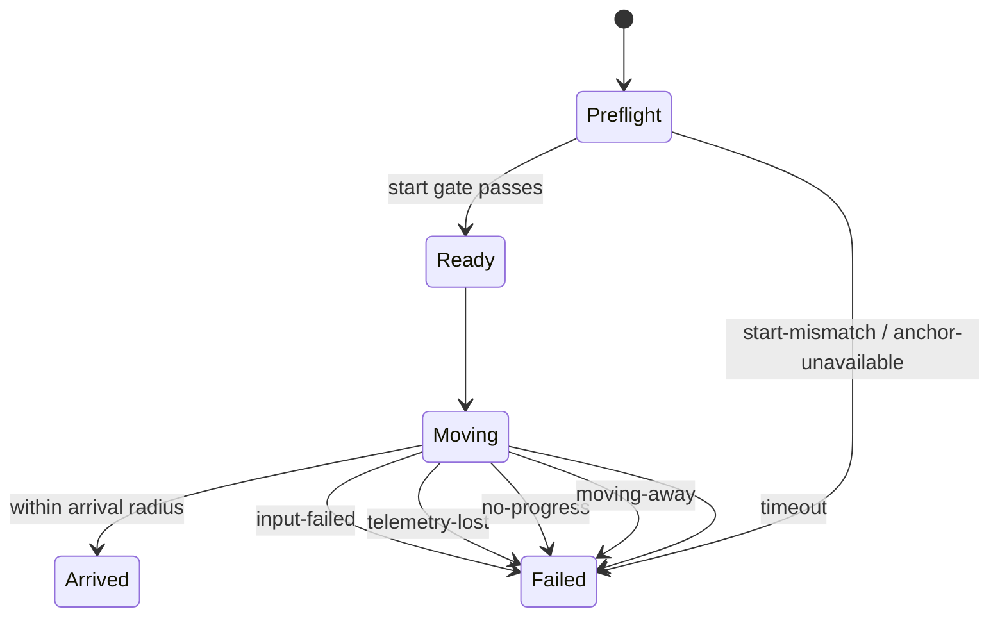

# Waypoint Navigation V1

## Status

Waypoint navigation v1 is implemented as of **April 16, 2026** for the external
reader in `C:\RIFT MODDING\RiftReader\reader\RiftReader.Reader`.

This first slice is intentionally narrow:

| Area | V1 behavior |
|---|---|
| Control model | **Manual-align first by default**. The reader core can now optionally auto-turn before forward movement with `--auto-turn-before-move`; April 23 live v3-prep runs proved deliberately misaligned routes where corrective turn input improved alignment and strict coord-trace forward travel arrived. |
| Waypoint source | External tracked JSON at `C:\RIFT MODDING\RiftReader\scripts\navigation\waypoints.json` |
| Movement backend | .NET 10 orchestration with a thin adapter over `C:\RIFT MODDING\RiftReader\scripts\post-rift-key.ps1` |
| Live telemetry | Active movement requires the validated coord-trace anchor; read-only summaries may still surface fallback anchors when they are explicitly labeled by `anchorSource` |
| Addon boundary | Addon stays telemetry / validation only in v1 |
| Safety model | Fail closed on bad start, no progress, moving away, anchor loss, input failure, or timeout |

## Scope

### Included in v1

- waypoint-file-backed navigation config
- `--read-navigation-current` preflight vector summary
- `--plan-navigation-route` read-only v3 route-chain planning
- `--navigate-waypoint-route` explicit active v3 route-chain execution gate with
  opt-in per-segment auto-turn
- `--navigate-waypoints` single-segment forward travel
- opt-in reader-core pre-movement auto-turn
- optional one-shot run / walk pace toggles
- verified live coord-anchor resolution before movement
- direct memory coord reads during movement
- stop reasons for the common unsafe or broken cases

### Explicit non-goals

- strafe corrections
- obstacle avoidance
- route graphs
- promoted/proof-suite-active multi-waypoint chaining
- terrain intelligence
- addon waypoint UI
- slash waypoint capture

## Architecture



### Pose resolution policy

`--navigate-waypoints` is now proof-strict:

1. current-process coord-trace anchor
2. fail closed with `anchor-unavailable`

`--read-navigation-current` remains read-only and may still fall back in this
order:

1. current-process coord-trace anchor
2. cached player-current anchor
3. one-time `PlayerCurrentReader.ReadCurrent(...)` reacquisition

If the summary output reports any `anchorSource` other than
`coord-trace-anchor`, treat it as a read-only fallback result rather than
proof-grade movement truth.

### Facing / movement bearing policy

Navigation compares destination bearings against the actor-facing **basis
vector mapped into forward-key movement bearing**. The raw actor-facing
estimate is still derived from the `Basis@0xD4.Forward` row, but route
generation and auto-turn planning must use the movement bearing proven by live
`W` input:

- raw actor yaw estimate: `atan2(forwardZ, forwardX)`
- forward-key movement bearing: `atan2(-forwardX, -forwardZ)`
- route provenance label: `provenance.navigationBearingKind =
  "forward-key-movement-bearing"`

Do not treat raw actor yaw as a route bearing. On May 8, 2026, a current-PID
live A/B smoke proved the prior movement-space convention was 180 degrees
opposite actual `W` movement: the first route failed safely with `no-progress`
and distance worsened from `1.0000m` to `1.6381m`; the fixed-bearing route then
arrived after one pulse, reducing distance from `1.0000m` to `0.6653m`.

Waypoint files may omit provenance for older hand-authored routes, but when
`provenance.navigationBearingKind` is present the loader only accepts
`forward-key-movement-bearing`. Unsupported labels fail closed so `actor-yaw`
metadata cannot masquerade as movement-bearing metadata.

Waypoint rewrites keep the schema field names in camel case and preserve
unknown `provenance` extension fields. This is intentional because generated
smoke routes carry process/session/proof metadata beyond the fields that the
loader actively validates.

### State machine



## Waypoint file schema

Default file:

- `C:\RIFT MODDING\RiftReader\scripts\navigation\waypoints.json`

Schema:

```json
{
  "schemaVersion": 1,
  "provenance": {
    "kind": "smoke-route",
    "navigationBearingKind": "forward-key-movement-bearing",
    "navigationBearingSource": "actor-facing-basis-opposite-xz-projection",
    "navigationBearingDegrees": -145.71781003282072
  },
  "movement": {
    "forwardKey": "w",
    "runKey": null,
    "walkKey": null,
    "defaultPace": "keep",
    "forwardPulseMilliseconds": 250,
    "postPulseSampleDelayMilliseconds": 150,
    "startRadius": 2.0,
    "defaultArrivalRadius": 1.5,
    "noProgressWindowMilliseconds": 1500,
    "minimumProgressDistance": 0.35,
    "wrongWayToleranceDistance": 0.75,
    "maxTravelSeconds": 30
  },
  "waypoints": [
    {
      "id": "example_start",
      "label": "Example Start",
      "zone": "optional metadata only",
      "x": 0.0,
      "y": 0.0,
      "z": 0.0,
      "arrivalRadius": 2.0,
      "pace": "keep"
    }
  ]
}
```

### Validation rules

The loader rejects:

- missing `movement.forwardKey`
- unsupported `schemaVersion`
- duplicate waypoint ids
- invalid pace values
- missing `x`, `y`, or `z`
- non-positive timing / radius / distance fields

`zone` is metadata only in v1 and is **not** enforced as a runtime gate.

## CLI

### Read-only navigation preflight

Returns the current vector from the live player position to the destination
waypoint. When the current behavior-backed actor-facing lead is valid for the
same live process, the summary also surfaces current yaw / pitch plus the
signed / absolute heading delta to the destination bearing. That facing data is
manual-alignment guidance and the planning input for opt-in reader-core
auto-turn;
it does not change the proof-grade coord-anchor requirement for movement.

```powershell
dotnet run --project C:\RIFT MODDING\RiftReader\reader\RiftReader.Reader\RiftReader.Reader.csproj -- `
  --process-name rift_x64 `
  --read-navigation-current `
  --destination-waypoint example_destination `
  --json
```

### Active waypoint travel

```powershell
dotnet run --project C:\RIFT MODDING\RiftReader\reader\RiftReader.Reader\RiftReader.Reader.csproj -- `
  --process-name rift_x64 `
  --navigate-waypoints `
  --start-waypoint example_start `
  --destination-waypoint example_destination `
  --pace keep `
  --json
```

### Active v3 waypoint route travel

`--navigate-waypoint-route` is the explicit active-input gate for chained route
execution. It runs the ordered start / via / destination route through the
same proof-strict movement core and stops on the first failed segment. Add
`--auto-turn-before-move` to run the current proof-strict auto-turn before each
segment. This path is available for v3 prep, but live two-segment proof-suite
promotion is still pending.

```powershell
dotnet run --project C:\RIFT MODDING\RiftReader\reader\RiftReader.Reader\RiftReader.Reader.csproj -- `
  --process-name rift_x64 `
  --navigate-waypoint-route `
  --start-waypoint example_start `
  --via-waypoint example_mid `
  --destination-waypoint example_destination `
  --auto-turn-before-move `
  --json
```

### Active waypoint travel with opt-in reader-core auto-turn

`--navigate-waypoints` can now opt into pre-movement auto-turn using the live
actor-facing truth that powers the facing-aware preflight summary:

```powershell
dotnet run --project C:\RIFT MODDING\RiftReader\reader\RiftReader.Reader\RiftReader.Reader.csproj -- `
  --process-name rift_x64 `
  --navigate-waypoints `
  --start-waypoint example_start `
  --destination-waypoint example_destination `
  --pace keep `
  --auto-turn-before-move `
  --auto-turn-within-degrees 7.5 `
  --turn-pulse-ms 75 `
  --turn-max-pulses 12 `
  --turn-worsening-tolerance 0.5 `
  --turn-max-worsening-pulses 2 `
  --json
```

This remains opt-in and fail-closed. It still depends on the validated
coord-trace anchor for live movement, and it aborts instead of forcing repeated
turns when heading alignment does not improve or worsens across consecutive
pulses.

For text output, the reader now has two navigation-result verbosity levels:

| Mode | What you get |
|---|---|
| default text output | compact summary, event counts, and the latest navigation / auto-turn event |
| `--verbose-navigation-events` | the same summary plus the full compact event timeline for navigation and auto-turn |

Example verbose text run:

```powershell
dotnet run --project C:\RIFT MODDING\RiftReader\reader\RiftReader.Reader\RiftReader.Reader.csproj -- `
  --process-name rift_x64 `
  --navigate-waypoints `
  --start-waypoint example_start `
  --destination-waypoint example_destination `
  --pace keep `
  --auto-turn-before-move `
  --auto-turn-within-degrees 7.5 `
  --verbose-navigation-events
```

For durable run evidence, add `--navigation-run-summary-file <path>` to
`--navigate-waypoints` or `--navigate-waypoint-route`. The reader writes the
same JSON result object that `--json` prints, including fail-closed results such
as `start-mismatch`, `anchor-unavailable`, and `input-failed`. This is preferred
for live smoke evidence because it avoids copying result JSON from the terminal
transcript after movement.

The prototype wrapper still exists as a higher-level helper, but the current
reader-core path is now the authoritative auto-turn entrypoint. The wrapper
also exposes two diagnostics-only controls for live blocker work:

| Wrapper switch | Purpose |
|---|---|
| `-AutoTurnUsePostMessage` | Use exact-HWND `PostMessage` delivery for turn pulses instead of foreground `SendInput`. |
| `-AutoTurnMinImprovementDegrees` / `-AutoTurnMaxNoImprovementPulses` | Fail closed when successful key-helper exits do not actually improve actor-facing delta enough across repeated pulses. |

### Turn-key backend profiler

When auto-turn blocks on key delivery or non-converging yaw, profile the turn
key/backend before running another waypoint attempt:

```powershell
python C:\RIFT MODDING\RiftReader\scripts\profile_turn_keys.py `
  --pid 33912 `
  --hwnd 0xE0DB2 `
  --keys a d A D Left Right `
  --input-modes foreground-sendinput post-message `
  --repeat 2 `
  --hold-ms 125 `
  --live `
  --refresh-proof-first
```

Without `--live`, the profiler writes a plan and verifies the exact PID/HWND
target but sends no input. With `--live`, it records before/after
actor-facing yaw, proof-coordinate readbacks, exact input mode/shell, and
optional screenshots. It promotes only key/backend combos that produce at least
two same-sign yaw deltas above the configured threshold without proof-coordinate
movement. If a key causes coordinate movement, the default is to stop remaining
attempts and report `blocked-unintended-movement`. If the 60-second proof gate
expires during a multi-key profile, reduce the key set or use
`--refresh-proof-before-each-attempt` for a slower but fresher per-attempt run.

### TomTom waypoint import

`--import-tomtom-waypoints` converts TomTom saved-variable waypoint lists into
RiftReader waypoint JSON without attaching to the live process. TomTom stores
only Rift `coordX` and `coordZ`; imported waypoints use `--tomtom-default-y`
when provided, otherwise `0`.

```powershell
dotnet run --project C:\RIFT MODDING\RiftReader\reader\RiftReader.Reader\RiftReader.Reader.csproj -- `
  --import-tomtom-waypoints `
  --tomtom-saved-variables-file C:\Users\mrkoo\OneDrive\Documents\RIFT\Interface\Saved\rift315.1@gmail.com\Deepwood\Atank\SavedVariables\TomTom.lua `
  --navigation-waypoint-file C:\RIFT MODDING\RiftReader\scripts\navigation\tomtom-waypoints.json `
  --tomtom-id-prefix tomtom `
  --tomtom-default-y 0 `
  --json
```

Use repeated `--tomtom-list <name>` to import only selected TomTom lists, and
`--tomtom-zone <zoneId>` to keep only entries from one Rift zone id.

### Supported navigation switches

| Switch | Meaning |
|---|---|
| `--import-tomtom-waypoints` | Offline import from `TomTomGlobal.PickupLocations` into waypoint JSON |
| `--tomtom-saved-variables-file <path>` | TomTom saved variables Lua file to import |
| `--tomtom-list <name>` | Optional repeated list filter; imports all lists when omitted |
| `--tomtom-zone <zoneId>` | Optional TomTom/Rift zone id filter |
| `--tomtom-default-y <double>` | Imported Y/height value because TomTom stores only X/Z; defaults to `0` |
| `--tomtom-id-prefix <prefix>` | Imported waypoint id prefix; defaults to `tomtom` |
| `--tomtom-arrival-radius <double>` | Optional arrival radius stamped on imported waypoints |
| `--tomtom-pace run\|walk\|keep` | Optional pace stamped on imported waypoints |
| `--navigation-waypoint-file <path>` | Optional override for the default waypoint JSON |
| `--read-navigation-current` | Read-only waypoint vector summary |
| `--plan-navigation-route` | Read-only v3 route-chain planning |
| `--navigate-waypoint-route` | Active v3 route-chain execution gate |
| `--via-waypoint <id>` | Optional repeated midpoint for route modes |
| `--navigate-waypoints` | Active waypoint travel |
| `--navigation-run-summary-file <path>` | Optional durable JSON result path for `--navigate-waypoints` and `--navigate-waypoint-route` |
| `--start-waypoint <id>` | Required for active/route waypoint modes |
| `--destination-waypoint <id>` | Required for active/route waypoint modes and read-only destination preflight |
| `--pace run\|walk\|keep` | Optional pace override |
| `--arrival-radius <double>` | Override arrival radius |
| `--max-travel-seconds <int>` | Override movement timeout |
| `--auto-turn-before-move` | Opt into pre-movement turn alignment before single-segment travel or before each active route segment |
| `--auto-turn-within-degrees <double>` | Alignment threshold for auto-turn completion |
| `--turn-left-key <key>` / `--turn-right-key <key>` | Override turn keys for auto-turn |
| `--turn-pulse-ms <int>` / `--turn-post-sample-delay-ms <int>` | Tune turn pulse duration and post-pulse re-sample delay |
| `--turn-max-pulses <int>` | Cap the number of turn attempts before failing closed |
| `--turn-worsening-tolerance <double>` / `--turn-max-worsening-pulses <int>` | Abort auto-turn if heading gets worse repeatedly |
| `--verbose-navigation-events` | Print the full text event timeline instead of only the latest event summaries |
| `--json` | Structured output for either waypoint mode |

## Movement behavior

### Start gate

The start waypoint is a **gate**, not a path node.

Before movement begins, the reader checks the live player planar distance from
the configured start waypoint using **X/Z**. If that distance is greater than
`movement.startRadius`, the run aborts with `start-mismatch`.

### Pace handling

- `keep`: do not change pace state
- `run`: press `movement.runKey` once if configured
- `walk`: press `movement.walkKey` once if configured

If an explicit `run` or `walk` pace is requested but the required key cannot be
sent, the run fails closed with `input-failed`.

### Forward movement loop

Each loop:

1. press `movement.forwardKey` for `movement.forwardPulseMilliseconds`
2. wait `movement.postPulseSampleDelayMilliseconds`
3. read live coordinates directly from memory
4. recompute planar distance to the destination waypoint

Success condition:

- destination planar distance is within the effective arrival radius

Failure conditions:

- `no-progress`: not enough improvement within the configured no-progress window
- `moving-away`: distance increases past the wrong-way tolerance
- `telemetry-lost`: coord sample cannot be read mid-run
- `input-failed`: key post fails
- `timeout`: total runtime exceeds the max travel limit

## Output contracts

### `NavigationVectorSummary`

- current coord
- destination coord
- `deltaX`, `deltaY`, `deltaZ`
- `planarDistance` using **X/Z**
- `heightDelta` using **Y**
- `worldBearingRadians`
- `worldBearingDegrees`
- `withinArrivalRadius`

### `NavigationRunResult`

- `status`
- `startWaypointId`
- `destinationWaypointId`
- `pace`
- `anchorSource`
- `initialPlanarDistance`
- `finalPlanarDistance`
- `pulseCount`
- `stopReason`

## Safety rules

- do not send any input until a verified coord anchor is resolved
- do not start active movement from cached or reacquired fallback anchors
- do not keep moving if telemetry is lost
- do not continue if distance is getting worse
- do not continue if the player is not making measurable progress
- do not rely on saved-variable refresh during movement
- do not continue auto-turn if heading worsens repeatedly
- do not attempt strafe or obstacle-recovery logic in this slice

## Live testing checklist

Use this checklist before tonight’s first live run:

| Step | Check |
|---|---|
| 1 | Confirm the target process is the intended Rift client |
| 2 | If you are not using `--auto-turn-before-move`, confirm the character is manually facing roughly toward the destination |
| 3 | Run `--read-navigation-current` first and verify the destination vector looks sane |
| 4 | Confirm the current position is inside the start waypoint radius |
| 5 | Start with `--pace keep` unless run / walk toggles are already validated |
| 6 | Use open flat terrain for the first travel test |
| 7 | Expect failure stops instead of recovery behavior when facing or terrain is wrong |

## Navigation proof suite

Use the repo-owned proof suite to recheck the current navigation slice before
or after changes:

- offline hardening only:
  - `pwsh -NoLogo -NoProfile -ExecutionPolicy Bypass -File C:\RIFT MODDING\RiftReader\scripts\navigation\test-navigation-proof-suite.ps1`
- include the current live smoke-route + preflight validation:
  - `pwsh -NoLogo -NoProfile -ExecutionPolicy Bypass -File C:\RIFT MODDING\RiftReader\scripts\navigation\test-navigation-proof-suite.ps1 -IncludeLive -SkipRefresh -ProcessName rift_x64`
  - this also validates the current smoke route through `--plan-navigation-route`
    and asserts the route-plan segment payload
- include live active aligned movement after preflight validation:
  - `pwsh -NoLogo -NoProfile -ExecutionPolicy Bypass -File C:\RIFT MODDING\RiftReader\scripts\navigation\test-navigation-proof-suite.ps1 -IncludeLive -IncludeActiveMovement -ProcessName rift_x64`
- include the v3-prep deliberately misaligned auto-turn + active movement proof:
  - `pwsh -NoLogo -NoProfile -ExecutionPolicy Bypass -File C:\RIFT MODDING\RiftReader\scripts\navigation\test-navigation-proof-suite.ps1 -IncludeLive -IncludeMisalignedAutoTurn -MisalignedBearingOffsetDegrees 20 -ProcessName rift_x64`

The active flags send live input to Rift. Use them only after confirming the
window/process, terrain, and route are safe. When running the active suite from
automation, keep Rift foreground through the active step; after a fresh
smoke-route/preflight, `-SkipRefresh` avoids extra `/reloadui` foreground churn.
The suite preserves nested script output on failure so foreground/focus aborts
are visible in the final summary.

## V2 / V3 progression snapshot

Current movement posture:

- v1 reader movement remains proof-strict and single-segment
- the current v2 bridge is now the **read-only facing-aware preflight** plus
  opt-in reader-core auto-turn on `--navigate-waypoints`
- v3 route-chain planning is available via `--plan-navigation-route`; the
  active chained route path is explicitly gated behind
  `--navigate-waypoint-route`, can opt into per-segment auto-turn, preserves
  per-segment results, and stops on first failed segment
- the proof suite now asserts read-only smoke route-plan segment metadata; an
  active multi-segment route proof is still pending
- v3-prep live proof now exists for deliberately misaligned routes: the first
  `navigation-prototype-20260423-195303-923` run started about `19.9°` off,
  sent one corrective `d` pulse, improved the delta to about `2.7°`, then
  arrived through strict `coord-trace-anchor` forward travel; the repeat proof
  `navigation-prototype-20260423-201344-231` ran through the proof suite with
  `-IncludeLive -IncludeMisalignedAutoTurn -SkipRefresh`, corrected about
  `20.0°` to about `2.1°`, and arrived in two forward pulses

## Current limitations

As of **April 23, 2026**:

- current actor-facing truth on `main` is restored, but canonical
  `--navigate-waypoints` movement is still **single-segment only**
- `--plan-navigation-route` can validate a route chain, and
  `--navigate-waypoint-route` can execute it as a v3-prep active gate; this
  route path is not yet promoted through a live two-segment proof
- the core reader path is still **straight-line, same-segment, and no obstacle
  avoidance**
- reader-core auto-turn is still **opt-in** and fail-closed, but deliberately
  misaligned live routes are now proven end-to-end and repeatable through the
  proof suite
- broader v3 work still needs live route proofing and obstacle/terrain handling
  before promotion
- addon work remains minimal in v1

For the v3 task plan and current route-chain status, see
`C:\RIFT MODDING\RiftReader\docs\navigation-v3-plan.md`.

