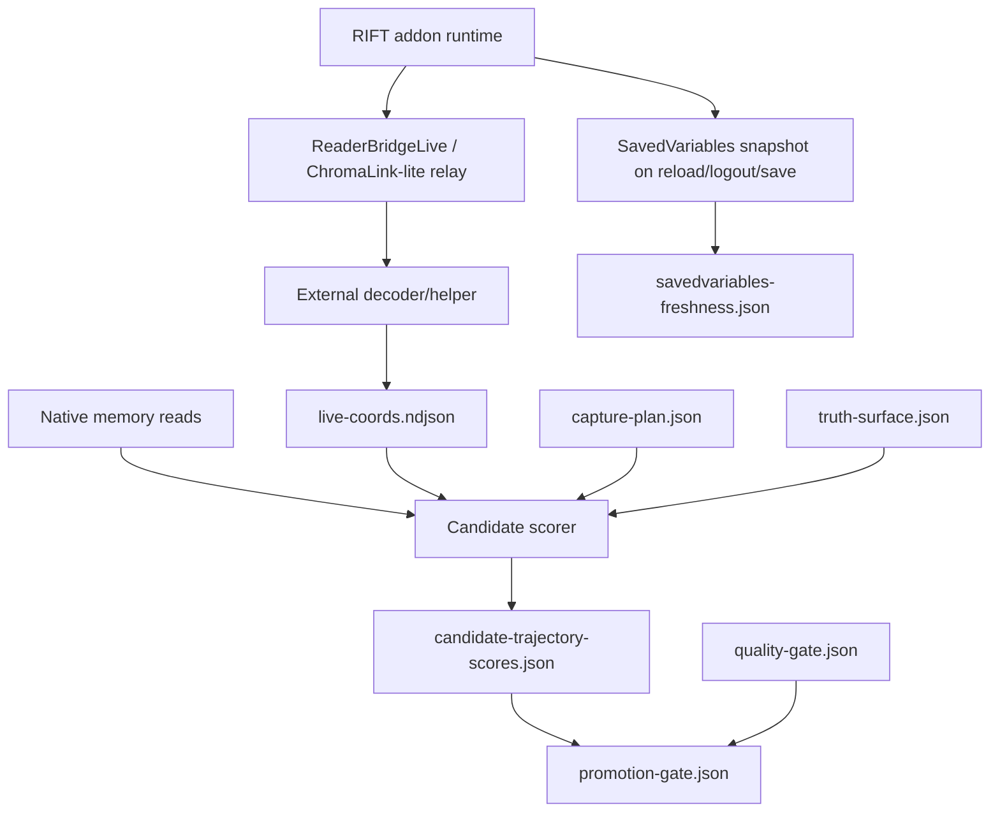

# Targeted ChromaLink Live-Telemetry Integration Plan — 2026-04-30

Status: **prepared plan / not yet implemented**  
Scope: `C:\RIFT MODDING\RiftReader` using selected patterns from
`C:\Users\mrkoo\OneDrive\Documents\RIFT\Interface\AddOns\ChromaLink`  
Constraint: **Do not wholesale-merge ChromaLink. Reuse/adapt only the live
telemetry relay parts needed by RiftReader.**

2026-05-01 update: ChromaLink `main` now exposes a dedicated read-only
RiftReader world-state HTTP surface:

| Surface | Path / package | Integration status |
|---|---|---|
| HTTP world state | `GET http://127.0.0.1:7337/api/v1/riftreader/world-state` | **Preferred RiftReader ingestion surface** when the bridge is running |
| HTTP schema | `GET http://127.0.0.1:7337/api/v1/riftreader/world-state/schema` | Contract discovery / drift guard |
| Typed .NET client | `DesktopDotNet/ChromaLink.Client` | Useful reference; do not add a hard external project dependency until needed |
| Raw rolling snapshot | `%LOCALAPPDATA%\ChromaLink\DesktopDotNet\out\chromalink-live-telemetry.json` | Diagnostic / fallback only |

RiftReader scripts now support the new world-state path via `-WorldStateUrl`
for live bridge reads and `-WorldStatePath` for offline contract fixtures while
retaining the legacy `-SnapshotPath` flow.

## TL;DR

ChromaLink is primarily a **live addon telemetry relay**. RiftReader should use
the best ChromaLink ideas to create a reliable live truth feed for coordinate
and other live testing, while keeping RiftReader's memory reader as the proof
and discovery surface.

Important source distinction: ChromaLink's `playerPosition` feed is
API-derived addon runtime data, not RiftReader memory-discovered data. The
current ChromaLink addon reads `Inspect.Unit.Detail("player").coordX/coordY/coordZ`
and encodes those values into a live `playerPosition` frame. Memory discovery
can consume this as live truth; it is not a prerequisite for ChromaLink to
produce the coordinates.

| Channel | Role |
|---|---|
| ChromaLink RiftReader world-state HTTP endpoint | Preferred read-only local app surface for live player/target/follow-unit position/status |
| ChromaLink-style relay / raw snapshot | Live API-derived addon telemetry: player position first, other player/target data later; independent of RiftReader memory-coordinate discovery |
| RiftReader native memory reader | Candidate discovery, memory proof, source/provenance work |
| SavedVariables | Backup/archive/post-`/reloadui` snapshot only |
| Metadata/logging | Prevent stale truth, ambiguous timing, and bad promotion |

## Design boundaries

| Decision | Rationale |
|---|---|
| Do not copy the full ChromaLink project into RiftReader | ChromaLink includes combat/RiftMeter/helper scope that is not needed for coord discovery |
| Start by consuming the RiftReader world-state endpoint, then fall back to raw `playerPosition` telemetry only for diagnostics | Coordinates are the current blocker; the new endpoint avoids hand-parsing the full diagnostic snapshot |
| Treat ChromaLink position as API truth, not memory proof | It does not require a pre-existing memory anchor, but it also does not prove internal memory provenance by itself |
| Keep SavedVariables as backup | They are valuable after `/reloadui`/logout/UI save, but not live IPC |
| Keep memory proof separate | A live addon relay proves observed game state, not internal memory provenance |
| Expand later only after player position is stable | Avoids overbuilding and keeps the first integration testable |

## ChromaLink parts to reuse or adapt

| ChromaLink pattern | RiftReader use |
|---|---|
| `Event.System.Update.Begin` refresh loop | Live updates without repeated `/reloadui` |
| `refreshIntervalSeconds = 0.10` style cadence | 10 Hz telemetry source; recorder can downsample to 1 Hz or desired rate |
| Pixel/symbol strip relay | Machine-readable screen bridge; better than OCR/manual text extraction |
| `playerPosition` frame | Live X/Y/Z truth feed for memory candidate scoring |
| Frame sequence numbers | Detect stale/repeated frames and dropped frames |
| Schema/version contract | Prevent silent protocol drift between addon and decoder |
| Decoder/search tooling | Screenshot/crop/pixel stream -> structured JSON/NDJSON |
| Telemetry snapshot writer pattern | Latest telemetry with freshness and age metrics |
| Repository consistency tests | Guard addon/desktop protocol sync |
| Helper readiness/result-check pattern | Ensure live inputs caused observable telemetry changes |

## What not to port initially

| Avoid initially | Reason |
|---|---|
| RiftMeter/combat aggregation | Not needed for coordinate discovery |
| Full ability/watch/aura/text page relay | Useful later, but scope creep now |
| Full ChromaLink UI layout | RiftReader needs a smaller ReaderBridgeLive panel/strip |
| Navigation promises | Position feed is not a complete navigation system |
| SavedVariables as live feed | Confirmed design flaw; backup/snapshot only |

## Target architecture

## Phase 1 — Workflow and metadata hardening

Purpose: prevent another stale-SavedVariables capture before any relay porting.

| Task | Output | Acceptance |
|---|---|---|
| Add `truth-surface.json` to every bundle | `truth-surface.json` | Declares authoritative truth source before analysis |
| Add `savedvariables-freshness.json` whenever SavedVariables are read | `savedvariables-freshness.json` | Records file path, `LastWriteTimeUtc`, capture start/end, freshness classification |
| Clear preflight contamination before START | clean `samples.ndjson` or explicit `samples-recording-only.ndjson` | No hidden preflight line in canonical analysis input |
| Add START/STOP lifecycle state | `capture-lifecycle.ndjson` | READY, START, sample, STOP, finalize events are explicit |
| Fail closed on stale live-truth source | `quality-gate.json` | SavedVariables cannot be used as live truth if timestamp predates capture |

## Phase 2 — Use existing ChromaLink feed as reference/prototype

Purpose: prove ChromaLink-style live telemetry is useful before copying or
adapting code into RiftReader.

| Task | Output | Acceptance |
|---|---|---|
| Inspect HTTP world-state path and schema | notes or code map | Confirm `/api/v1/riftreader/world-state` exposes `player.position.x/y/z`, freshness, readiness, source contract, and limitations |
| Capture ChromaLink player position while moving | `chromalink-live-coords.ndjson` | Coordinates update through `-WorldStateUrl` without `/reloadui` |
| Compare ChromaLink coords to visible ReaderBridge or PlayerCoords overlay | `chromalink-overlay-alignment.json` | Values align within expected display precision/timing; ReaderBridge already reads API coords at runtime, and PlayerCoords is optional visual/manual validation only, not a repo dependency or SavedVariables-backed live feed |
| Record sequence/freshness behavior | `chromalink-freshness-check.json` | Detect repeated, stale, or dropped frames |
| Use ChromaLink data as `truthSurface` for one bundle | `truth-surface.json` | Analysis uses `chromalink-riftreader-world-state` / `chromalink-live-telemetry`, not SavedVariables |

## Phase 3 — Build ReaderBridgeLive / ChromaLink-lite in RiftReader

Purpose: create a minimal RiftReader-owned live relay once the prototype path is
proven.

Initial frame fields:

| Field | Purpose |
|---|---|
| `schemaVersion` | Protocol compatibility |
| `sequence` | Stale/repeat/drop detection |
| `addonRealtime` | Align addon frame time to helper time |
| `playerX/playerY/playerZ` | Live coordinate relay payload; usable as truth only when sequence/freshness gates pass and it is aligned against a visible overlay or another validated live surface |
| `speed` | Movement quality and stuck detection |
| `zone/shard` optional | Context/freshness sanity |
| `crc` / checksum | Decode correctness |

Implementation slices:

| Slice | Work | Notes |
|---|---|---|
| Addon runtime | Add fixed ReaderBridgeLive text/pixel panel | Small, high contrast, fixed crop region |
| Protocol | Define minimal player-position frame | Borrow ChromaLink sequence/version/checksum style |
| Decoder | Crop and decode panel/strip | First text/manual fallback, then pixel decoder |
| Output | Write `live-coords.ndjson` and latest snapshot | Include frame age, sequence, decode quality |
| Tests | Synthetic frame encode/decode tests | Prevent drift without live game |

## Phase 4 — Robust logging and metadata contract

Every live test/bundle should produce these artifacts:

| Artifact | Required content |
|---|---|
| `artifact-index.json` | Canonical file list and roles |
| `capture-plan.json` | Hypotheses, target PID/HWND, truth surface, movement plan, stop conditions |
| `process-window.json` | PID, HWND, title, process start time, foreground/focus state when relevant |
| `truth-surface.json` | Authoritative live truth source and non-truth/candidate surfaces |
| `savedvariables-freshness.json` | Snapshot freshness if SavedVariables are read |
| `recorder-preflight.json` | Decoder/crop/process/window readiness before START |
| `capture-lifecycle.ndjson` | READY/START/sample/STOP/finalize events |
| `input-events.ndjson` | Manual and automated input events, including exact method and target |
| `live-coords.ndjson` | Decoded live telemetry with sequence/freshness/confidence |
| `memory-timeseries.csv` | Candidate memory reads aligned to live coord samples |
| `quality-gate.json` | Movement amount, unique coords, Z variation, frame drops, stale frames, duplicate frames |
| `candidate-trajectory-scores.json` | Candidate ranking vs live trajectory |
| `next-seeds.json` | Follow-up seed addresses and reasons |
| `promotion-gate.json` | Fail-closed proof/promotion decision |

## Phase 5 — Candidate scoring integration

Purpose: turn live telemetry into memory discovery evidence.

| Step | Method |
|---|---|
| Normalize live coords | Use `live-coords.ndjson` or overlay-extracted coords as ground truth |
| Align memory reads | Pair each memory sample with nearest live telemetry frame |
| Score each seed | Correlation, direction, magnitude, range plausibility, stationary-tail behavior |
| Reject stale/static/cache | Use duplicate/stationary sections and stale metadata |
| Classify winners | `live-tracking`, `partial-axis`, `static-cache`, `stale-post-save-snapshot`, `garbage-float`, `mirror`, `unknown` |
| Generate next seeds | Base guesses, pointer refs, nearby triplets, mirror clusters |
| Gate promotion | Candidate must pass movement, freshness, provenance, and quality checks |

## Phase 6 — Expand live telemetry after player position

Only expand after the player-position relay is stable.

| Later field | Why it helps |
|---|---|
| HP/max HP | Identity and state confirmation |
| Resource/charge | Player-state matching |
| Target name/coords/HP | Target discovery and target-change tests |
| Cast/channel state | Behavior and cast memory discovery |
| Zone/shard/location text | Context and freshness sanity |
| Speed/movement state | Movement quality, stuck detection, input validation |
| Follow-unit/party status | Multi-character automation/testing |
| Heading/yaw proxy if exposed or derived | Auto-turn/nav validation; memory-facing still remains proof source |

## Other live-testing benefits

Once integrated, the ChromaLink-style relay becomes a general live-test oracle.

| Live test | Relay contribution |
|---|---|
| Movement input | Confirms coords/speed changed after W/route input |
| Stuck/obstruction detection | Detects low movement despite input |
| Navigation smoke | Confirms distance-to-target decreases and arrival happens |
| Auto-turn | Correlates heading/facing proxy or memory-facing changes with input |
| Targeting | Confirms target changed after target/action input |
| Combat/cast tests | Confirms HP/resource/cast/combat state changed |
| Crash/restart recovery | Detects relay sequence reset, stale frames, process/window mismatch |
| Regression tests | Saved relay screenshots/frames can be replayed offline |
| Helper validation | Key dispatch is only "success" if telemetry changes as expected |
| Memory discovery | Provides ground truth trajectory for candidate scoring |

## Quality gates

| Gate | Fail condition |
|---|---|
| Truth source gate | No live truth surface declared |
| SavedVariables gate | SavedVariables timestamp predates capture and is being used as live |
| Decode gate | Checksum/CRC fails or decode confidence too low |
| Freshness gate | Frame age exceeds threshold or sequence stops unexpectedly |
| Movement gate | Too few unique coords, too little distance, or insufficient Z variation for the test |
| Timing gate | Memory samples cannot be aligned to live frames |
| Input gate | Input method/target not logged or target PID/HWND changed |
| Promotion gate | No candidate has live trajectory + stationary-tail + provenance evidence |

## Implementation order

| # | Action | Output |
|---:|---|---|
| 1 | Patch bundle recorder metadata/freshness handling | `truth-surface.json`, `savedvariables-freshness.json`, clean lifecycle |
| 2 | Prototype reading existing ChromaLink `playerPosition` | `chromalink-live-coords.ndjson` |
| 3 | Compare ChromaLink telemetry to overlay | `chromalink-overlay-alignment.json` |
| 4 | Add `live-coords.ndjson` as a standard RiftReader analysis input | scorer-ready live truth |
| 5 | Add candidate scorer against live coords | `candidate-trajectory-scores.json` |
| 6 | Add quality gate | `quality-gate.json` |
| 7 | Build ReaderBridgeLive minimal relay only after prototype passes | RiftReader-owned ChromaLink-lite relay |
| 8 | Add synthetic encode/decode/replay tests | drift guard |
| 9 | Add pixel/checksum decoder | robust machine decode |
| 10 | Expand relay fields beyond player position | other live testing support |

## SavedVariables role

SavedVariables remain useful, but only as a backup/snapshot channel.

| Use | Status |
|---|---|
| Post-run archive after `/reloadui` | Good |
| Backup of addon runtime trace | Good |
| Recovery checkpoint after crash/restart | Good |
| Schema/state debugging | Good |
| Pre-run baseline snapshot | Good if timestamped |
| Live per-second movement stream | Not valid |
| START/STOP ground truth without flush | Not valid |

## Immediate next milestone

**Milestone:** Use ChromaLink-style live position telemetry as the authoritative
truth source for one coord-analysis bundle, with SavedVariables explicitly
labeled backup/snapshot only.

Milestone outputs:

1. `truth-surface.json`
2. `savedvariables-freshness.json`
3. `chromalink-live-coords.ndjson` or `live-coords.ndjson`
4. `quality-gate.json`
5. `memory-timeseries.csv`
6. `candidate-trajectory-scores.json`
7. `promotion-gate.json`
