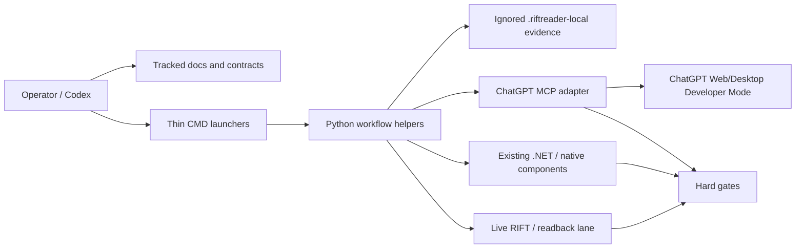
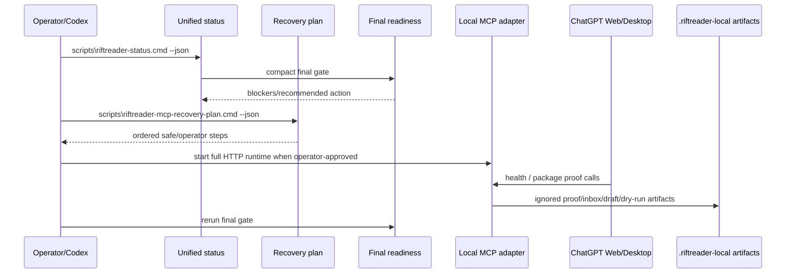

# RiftReader ChatGPT MCP architecture map

Status: Stage 55 docs map for the current monolithic RiftReader workflow repo.
This is an index and boundary map, not a replacement for the linked contracts.

## Verdict

RiftReader is still one repo, but it is no longer one undifferentiated workflow.
The repo is organized around modular, Python-first helper surfaces, thin CMD
launchers, existing .NET/native readback components, ignored local evidence, and
strict gates for live RIFT, debugger/CE, provider, proof-promotion, and Git
remote actions.

Do not split folders or extract packages from this map alone. Use it to choose
the next safe subsystem and the right contract before editing.

## High-level system

## Primary lanes

| Lane | Purpose | Entry points | Core docs | Safety boundary |
|---|---|---|---|---|
| Unified operator status | Resume-context packet for repo/runtime/proof/target state. | `scripts\riftreader-status.cmd --json` | `docs\workflow\operator-status.md` | Read-only by default; `--write` writes ignored local artifacts only. |
| MCP recovery plan | Ordered recovery checklist for final MCP readiness. | `scripts\riftreader-mcp-recovery-plan.cmd --json` | `docs\workflow\mcp-readiness-recovery.md` | Plans only; runtime start and actual ChatGPT proof are operator steps. |
| Final readiness | Authoritative release gate for clean tree, CI, proof, freshness, environment, tool surface, and public-session state. | `scripts\riftreader-mcp-final.cmd --status --compact-json` | `docs\workflow\riftreader-chatgpt-mcp-final-readiness.md` | Read-only; never starts server/tunnel, registers ChatGPT, mutates Git, or sends live input. |
| ChatGPT MCP adapter | Current 40-tool non-Codex ChatGPT Developer Mode surface. | `START_RIFTREADER_CHATGPT_MCP.cmd`, `scripts\riftreader-chatgpt-mcp.cmd` | `docs\workflow\riftreader-chatgpt-mcp.md` | Narrow allowlisted tools; no broad shell/filesystem/provider/live/debugger proxy. |
| Release/demo packet | Compact release evidence packet and safe-local refresh status. | `scripts\riftreader-release-demo-packet.cmd --json --write --summary-md --refresh-safe-local` | `tools\riftreader_workflow\release_demo_packet.py` plus final-readiness docs | Writes ignored release packet artifacts only; reports blockers, does not fix them. |
| Local artifact bridge and package flow | Inert proposal/draft/dry-run/apply workflow for ChatGPT-originated package proposals. | `scripts\riftreader-local-artifact-bridge.cmd`, `scripts\riftreader-package-draft-review.cmd` | `docs\workflow\local-artifact-bridge.md`, `docs\workflow\package-flow.md`, `docs\workflow\package-intake-lite.md` | Inbox/draft artifacts are ignored and inert until explicit dry-run/apply gates. |
| Git commit/push gates | Explicit-path local commits and approval-gated pushes. | `scripts\riftreader-safe-commit-packager.cmd --plan --json`; MCP `commit_reviewed_slice`, `push_current_branch` | `docs\workflow\local-git-gh-primary-workflow.md`, commit/push design docs | No `git add .`, no force push, no branch rewrite, no broad cleanup. |
| Validation ledger | Timestamped command validation summaries. | `python tools\riftreader_workflow\validation_ledger.py --tier targeted --command <cmd>` | `docs\workflow\timestamped-validation-ledger.md` | Records evidence; does not hide failures or mutate Git. |
| Live RIFT no-input/readback lane | Read-only target identity, readback, and proof-recovery diagnostics. | `scripts\riftreader-decision-packet.cmd --compact-json --write`, `scripts\get-rift-window-targets.cmd -Json` | live/proof-recovery handoffs and target-control docs | No movement/input/focus/click/proof promotion without explicit approval. |
| Debugger/CE planning lane | Static-first plan-only or fail-closed debugger/CE boundary artifacts. | MCP `plan_debugger_ce_action`, `execute_debugger_ce_action` | `docs\workflow\riftreader-chatgpt-mcp-debugger-ce-static-first-design.md` | No x64dbg/CE attach, breakpoints, watchpoints, or memory read/write without approval and backend support. |

## Code and artifact ownership

| Area | Tracked location | Generated/ignored location | Owner pattern |
|---|---|---|---|
| Workflow helpers | `tools\riftreader_workflow\*.py` | `.riftreader-local\*` | Python owns JSON parsing, subprocess envelopes, state machines, summaries, and fail-closed decisions. |
| Launchers | `scripts\riftreader-*.cmd`, root `START_RIFTREADER_CHATGPT_MCP.cmd` | none | CMD stays thin: change directory, call Python, pass through args. |
| Tests | `scripts\test_*.py` | `.riftreader-local\unit-test-temp\*` | Focused unittest modules cover helper contracts and denial paths. |
| MCP proof/evidence | tracked helper code and docs | `.riftreader-local\riftreader-chatgpt-mcp\*` | Proof, recovery, release, transport, contract, and eval artifacts are local evidence only. |
| Handoffs | `docs\handoffs\*.md`, `docs\HANDOFF.md` | ignored validation/run summaries | Handoffs summarize current truth; ignored artifacts provide detailed evidence. |
| .NET/native/readback components | existing solution/projects such as `RiftReader.slnx`, `LeaderInputProbe`, `LeaderInputVerifier`, `reader\*` | captures/summaries where documented | Keep low-level process/readback/native engine work in existing .NET/native surfaces unless a focused migration is requested. |

## Current MCP product flow

## Current final-readiness interpretation

| Signal | Meaning | Action |
|---|---|---|
| `artifactClassificationSummary.categoryCounts.expected-expired > 0` | Historical stopped/expired public URL artifacts exist. | Treat as context, not a release blocker. |
| `artifactClassificationSummary.categoryCounts.obsolete-superseded > 0` | Older broken/missing summaries are superseded by newer readable artifacts. | Keep as diagnostic context only. |
| `artifactClassificationSummary.releaseBlockerKeys` includes `artifact-age-exceeds-budget:actual-client-proof` | Actual ChatGPT proof is stale. | Fill/check/record a fresh actual-client proof; local runtime facts cannot replace it. |
| `ci:not-completed:*` | Current HEAD CI is still running. | Wait and rerun final readiness. |
| `git:dirty-worktree` | Current local changes are not covered by current-head CI. | Run safe commit plan and commit explicit paths only after validation. |
| `defaultServePortStatus=busy-or-unavailable` | Port `8770` is busy or cannot be bound by the environment check. | Warning for final gate; inspect server status before actual-client proof collection. |

## Modularization prep rules

| Rule | Reason |
|---|---|
| Keep the repo monolithic until a bounded extraction has a clear owner, API contract, migration path, and validation gate. | Prevents losing cross-lane safety context and handoff continuity. |
| Add or improve helper modules before moving files. | Current risk is workflow clarity, not filesystem layout. |
| Prefer docs indexes and contract maps over duplicate narrative docs. | Avoids stale copies of the MCP tool surface and proof rules. |
| Use ignored artifacts for run evidence, tracked docs for stable contracts. | Keeps Git history clean while preserving detailed diagnostics. |
| Keep OpenCode retired unless explicitly reauthorized in the current conversation. | Prevents reviving stale workflow branches. |

## Retired or historical surfaces

| Surface | Current status | Rule |
|---|---|---|
| OpenCode workflow | Retired/demoted | Do not add new OpenCode wrappers, prompts, tests, or integrations by default. |
| OpenAI Secure MCP Tunnel / `tunnel-client` | Retired for this lane | Do not use as primary or backup unless policy changes. |
| `trycloudflare.com` quick tunnels | Retired for this lane | Historical expired URLs are expected-expired context only. |
| Caddy/router/direct public-IP route | Deprecated | Do not recreate for the current ChatGPT MCP lane. |
| Legacy tokenized local HTTP MCP on port `8765` | Separate historical lane | Do not treat it as the current ChatGPT Developer Mode backend. |
| Broad local MCP proxying | Not part of final-ready surface | Do not proxy `rift_game`, Windows/Computer Use, arbitrary shell, arbitrary filesystem, provider writes, CE/x64dbg, or live input through the ChatGPT adapter. |

## Stage roadmap pointers

| Stage | Output | Status |
|---:|---|---|
| 51 | Unified operator status | `docs\workflow\operator-status.md`; implemented. |
| 52 | MCP readiness recovery plan | `docs\workflow\mcp-readiness-recovery.md`; implemented. |
| 53 | Release/demo packet v2 | `tools\riftreader_workflow\release_demo_packet.py`; implemented. |
| 54 | Stale artifact classification cleanup | Workflow/final/contract outputs now classify release blockers, operator actions, historical warnings, expected-expired artifacts, ignored local evidence, and obsolete/superseded artifacts. |
| 55 | This architecture map | Current file. |
| 56 | Contract docs | Next likely docs target: consolidate command/output contracts without duplicating the final readiness tool table. |
| 57 | No-input proof recovery readiness packet | Future safe local packet; must stay no-input/no-debug/no-provider/no-promotion. |
| 58 | Validation polish | Ongoing: prefer targeted ledger plus pre-commit for coherent slices. |

## Recommended resume order

1. `scripts\riftreader-status.cmd --json`
2. `scripts\riftreader-mcp-final.cmd --status --compact-json`
3. `scripts\riftreader-mcp-recovery-plan.cmd --json`
4. If editing: run targeted tests/ledger, then `scripts\riftreader-safe-commit-packager.cmd --plan --json`
5. If final release proof is the goal: start/verify the full HTTP MCP runtime, collect fresh actual ChatGPT proof, then rerun final readiness.
